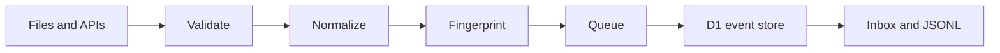

<div align="center">

# Feedback Collector

### One clean stream for every customer signal.

Collect, normalize, deduplicate, classify, store, and export product feedback—without paid infrastructure.


[Quick start](#quick-start) · [Architecture](#architecture) · [API](#api-reference) · [Deploy](#deploy-to-cloudflare) · [Roadmap](#roadmap)

</div>

## Why Feedback Collector?

Product feedback rarely lives in one place. It arrives through support tickets, surveys, app-store reviews, interviews, community posts, spreadsheets, and APIs. Every source uses a different structure, repeats the same requests, and carries different metadata.

Feedback Collector turns those scattered signals into a single, versioned stream of product evidence. It is the first project in **ProdMind** and supplies trustworthy input to the Sentiment Analyzer, Topic Modeler, Feature Request Detector, prioritization tools, and Voice-of-Customer dashboard.

## What it provides

- Manual feedback entry through a responsive web interface
- CSV and JSON file imports
- Generic paginated JSON API connector
- An hourly, credentialed Zendesk ingestion connector
- Mapping utilities for additional sources (not yet end-to-end integrations)
- Consistent, versioned feedback-event schema
- Whitespace cleaning and required-field validation
- Deterministic sentiment and intent classification
- SHA-256 content fingerprints and idempotent writes
- Exact duplicate removal across sources
- Persistent storage with Cloudflare D1
- Optional asynchronous ingestion with Cloudflare Queues
- Ingestion job status and failure auditing
- Connector retries with exponential backoff, jitter, and `Retry-After` support
- Per-minute API rate limiting
- Source filtering and normalized JSONL export
- Browser storage fallback when cloud bindings are unavailable
- Sample datasets and automated tests

## Product flow



1. A user submits feedback manually, imports a file, or connects an API source.
2. Source-specific records are converted to the common event contract.
3. Empty records are rejected and text is normalized.
4. A SHA-256 fingerprint prevents the same feedback from being stored twice.
5. Small requests can be processed immediately; larger workloads can use a Queue.
6. D1 stores the normalized event and its ingestion-job relationship.
7. Downstream systems consume the API or exported JSONL stream.

## Architecture

Feedback Collector uses a modular Cloudflare Worker rather than premature microservices. It remains inexpensive and easy to deploy while keeping clear boundaries for later extraction.

```text
feedback_collector/
├── examples/
│   ├── sample-feedback.csv
│   └── sample-feedback.json
├── migrations/
│   └── 0001_initial.sql
├── public/
│   ├── app.js
│   ├── feedback.js
│   ├── index.html
│   └── styles.css
├── schema/
│   └── feedback-event.schema.json
├── src/
│   ├── connectors.js
│   └── worker.js
├── test/
│   ├── connectors.test.js
│   └── feedback.test.js
├── package.json
├── README.md
└── wrangler.jsonc
```

| Component | Responsibility |
|---|---|
| `public/feedback.js` | Normalization, fingerprints, basic classification, deduplication, and CSV parsing |
| `public/app.js` | Browser imports, local persistence, metrics, and inbox rendering |
| `src/connectors.js` | Paginated connectors, source mappings, retries, and backoff |
| `src/worker.js` | HTTP API, rate limiting, job orchestration, Queue consumer, D1 writes, and exports |
| `schema/` | Versioned normalized-event contract |
| `migrations/` | Reproducible D1 schema and indexes |

## Normalized event

Every accepted record is converted into this logical structure:

```json
{
  "id": "feedback-123",
  "schemaVersion": "1.0",
  "text": "Please add weekly CSV exports",
  "source": "Support",
  "customer": "Acme",
  "createdAt": "2026-08-31T12:00:00.000Z",
  "sentiment": "neutral",
  "intent": "feature-request",
  "fingerprint": "64-character-sha256-hash",
  "metadata": {
    "connector": "zendesk",
    "originalId": "9876"
  }
}
```

The complete JSON Schema is available at [`schema/feedback-event.schema.json`](schema/feedback-event.schema.json).

## Quick start

### Requirements

- Node.js 20 or later
- npm
- A free Cloudflare account for cloud persistence and deployment

### Run locally

```bash
git clone https://github.com/MadanMohan0537/prodmind.git
cd prodmind/feedback_collector
npm install
npm test
npm run dev
```

Wrangler prints the local URL. The interface includes demonstration feedback and can run with browser storage before D1 or Queues are configured.

### Try sample data

Import either file from `examples/` through the web interface:

- `examples/sample-feedback.csv`
- `examples/sample-feedback.json`

CSV files should include a feedback column named `text`, `feedback`, `comment`, or `review`. Optional fields include `source`, `customer`, `user`, `timestamp`, and `createdAt`.

## API reference

### Health check

```http
GET /api/health
```

Returns the service name, schema version, and active storage mode.

### Ingest feedback

```http
POST /api/feedback
Content-Type: application/json
```

Single record:

```json
{
  "text": "The mobile filter crashes when I select a date",
  "source": "App Store",
  "customer": "Anonymous"
}
```

Batch request:

```json
{
  "source": "support-export",
  "records": [
    { "text": "Please add bulk archive", "customer": "Orbit" },
    { "text": "Search is slow", "customer": "Atlas" }
  ]
}
```

A batch can contain up to 1,000 records. With a Queue binding, the endpoint returns `202 Accepted` and a job ID. Without it, the request is processed immediately.

### List feedback

```http
GET /api/feedback?source=Support&limit=100
```

The maximum page size is 500 records.

### Inspect an ingestion job

```http
GET /api/jobs/{jobId}
```

Job records include received, accepted, duplicate, failure, and completion information.

### Export normalized events

```http
GET /api/export
```

Returns up to 10,000 normalized events as newline-delimited JSON (`application/x-ndjson`).

## Deploy to Cloudflare

The application uses free-tier-compatible Workers, D1, and Queues.

### 1. Authenticate Wrangler

```bash
npx wrangler login
```

### 2. Create the D1 database

```bash
npx wrangler d1 create feedback-collector-db
```

Copy the returned database ID into `wrangler.jsonc`, replacing:

```text
REPLACE_WITH_CLOUDFLARE_D1_DATABASE_ID
```

### 3. Create the ingestion queue

```bash
npx wrangler queues create feedback-ingestion
```

### 4. Configure security and Zendesk secrets

```bash
npx wrangler secret put API_TOKEN
npx wrangler secret put ZENDESK_SUBDOMAIN
npx wrangler secret put ZENDESK_EMAIL
npx wrangler secret put ZENDESK_TOKEN
```

Set `ALLOWED_ORIGINS` to the comma-separated origins permitted to call the API. Zendesk secrets are optional; when present, the hourly Cron Trigger performs incremental ticket ingestion.

### 5. Apply the database migration

```bash
npm run db:migrate:remote
```

### 6. Deploy

```bash
npm run deploy
```

Cloudflare can also connect to the GitHub repository and automatically deploy changes pushed to `main`.

## Connector development

`JsonApiConnector` handles pagination and standard retry behavior. Each source only needs to describe how its payload maps to the normalized input structure.

```js
import { JsonApiConnector } from "./src/connectors.js";

const communityConnector = new JsonApiConnector({
  name: "community",
  endpoint: "https://community.example.com/api/posts",
  headers: { Authorization: "Bearer API_TOKEN" },
  mapRecord: post => ({
    id: `community-${post.id}`,
    text: post.body,
    customer: post.author,
    createdAt: post.created_at
  }),
  nextPage: payload => payload.next
});
```

Store connector credentials using Cloudflare secrets, never in the repository:

```bash
npx wrangler secret put CONNECTOR_API_TOKEN
```

## Reliability and security

- Parameterized SQL statements prevent query injection.
- Secrets are excluded through `.gitignore` and Cloudflare secret bindings.
- Transient connector failures use exponential backoff and jitter.
- Upstream rate-limit instructions are honored through `Retry-After`.
- Every data endpoint requires a bearer token; only the health endpoint is public.
- CORS responses are limited to configured origins.
- D1 stores rate counters so limits apply across Worker isolates.
- The ingestion API enforces request and batch limits.
- Queue jobs retry three times and record terminal failures.
- Unique content fingerprints make ingestion idempotent.
- Schema versions allow compatible event evolution.
- No paid LLM, proxy network, CAPTCHA solver, or unauthorized scraper is required.

## Testing

```bash
npm test
```

The current 14-test suite verifies:

- Feature-request detection
- Negative-sentiment classification
- Input-field aliases and whitespace normalization
- Duplicate removal
- CSV parsing
- Zendesk record mapping
- Zendesk pagination
- Retry behavior after transient upstream failures
- Public health routing
- Unauthorized export rejection
- Disallowed-origin rejection
- Authenticated ingestion
- Matching client/server fingerprints

Run syntax checks and the complete suite together:

```bash
npm run check
```

## Zero-cost design choices

The original advanced concept suggested Kafka, a schema registry, a data lake, embedding-based duplicate detection, and distributed scrapers. Those tools become valuable at large production scale, but they would violate this project's zero-cost requirement today.

This implementation uses equivalent upgrade paths:

| Enterprise concept | Current zero-cost implementation | Upgrade boundary |
|---|---|---|
| Kafka/RabbitMQ | Cloudflare Queues | Sustained workloads beyond free allowances |
| Avro schema registry | Versioned JSON Schema | Multiple independent producers and consumers |
| Delta Lake | D1 plus JSONL export | Large analytical history and batch processing |
| Embedding deduplication | SHA-256 canonical fingerprints | Evidence that fuzzy duplicates materially affect decisions |
| Distributed scraping | Approved APIs and user imports | A permitted source requires browser extraction |

## Known limitations

- The lightweight CSV parser does not yet handle every multiline quoted-field edge case.
- Browser mode stores information per device and browser profile.
- Classification is deterministic and English-oriented in this version.
- Source mapping templates still require the relevant API credentials and account permissions.
- Exact fingerprints do not identify semantically similar rewrites.
- Free Cloudflare allowances impose daily and monthly ceilings.

These constraints are explicit so later complexity is added in response to real usage rather than speculation.

## Roadmap

- [x] Manual, CSV, and JSON ingestion
- [x] Normalized event contract
- [x] Exact deduplication and idempotent persistence
- [x] D1 migrations and indexed storage
- [x] Optional Queue-based processing
- [x] Connector retry and rate-limit handling
- [x] Ingestion audit jobs
- [x] JSONL export
- [ ] Import preview and column mapping
- [ ] Standards-compliant multiline CSV parser
- [ ] IndexedDB for larger offline datasets
- [x] Secured, scheduled Zendesk ingestion
- [x] Runtime validation and D1-backed rate limiting
- [ ] OAuth setup screens for additional live connectors
- [ ] Configurable taxonomies and classification confidence
- [ ] MinHash or local-embedding fuzzy duplicate detection
- [ ] PII detection and configurable redaction
- [ ] Dead-letter queue and operational metrics

## How this fits into ProdMind

```text
Feedback Collector
├── Sentiment Analyzer
├── Topic Modeler
├── Feature Request Detector
└── Voice-of-Customer Dashboard
```

Feedback Collector owns ingestion and normalization. Downstream projects consume its versioned event contract instead of reimplementing connectors or cleaning logic.

## Contributing

1. Fork the repository.
2. Create a focused feature branch.
3. Add or update tests.
4. Run `npm run check`.
5. Open a pull request explaining the problem and design decision.

Please do not commit customer data, credentials, generated build output, or unrelated modules from the other ProdMind projects.

## License

Licensed under the repository-level [Apache License 2.0](../LICENSE).

---

<div align="center">

Built as project 01 of [ProdMind](../README.md), using divide and conquer.

</div>
