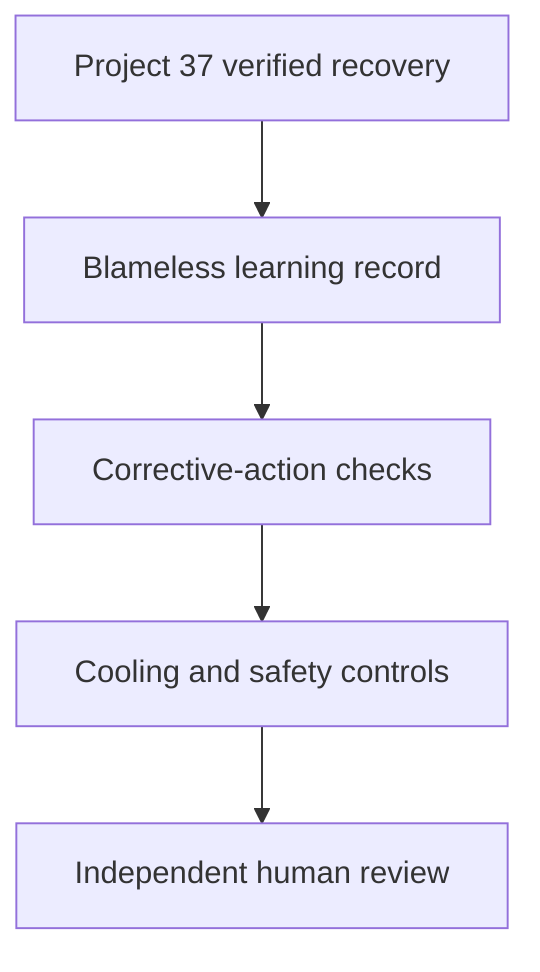

# Product Planning Policy Incident Learning & Re-entry Controller

Project 38 prevents a successful rollback from becoming the end of learning. After Project 37 verifies recovery, this project checks whether the incident has a timely, evidence-backed, blameless review and whether the organization is genuinely ready to attempt another policy experiment.

## Controls

- Verified Project 37 recovery and closure
- Timely post-incident publication
- Evidence-backed system conditions and lessons
- Owned, tracked, measurable preventive and detective actions
- Completed evidenced P0/P1 work and no overdue actions
- Cooling period and declared freeze
- Re-entry from the recovered baseline and within recovered scope
- Rollback and monitoring acknowledgement
- Independent Product, Operations, and Governance approval

`approve_reentry` yields `ready_for_reentry` only when every check passes. A failed check yields `blocked_reentry`; `continue_freeze` and `escalate` remain human actions.



This project never lifts a freeze, starts an experiment, changes policy, assigns blame, or proves causality.

## Run

```bash
npm test
npm run check
npx wrangler dev
```

Deploy after `npx wrangler secret put API_TOKEN`. No paid API, model, database, or runtime dependency is required.

## Research basis

- [Google SRE Postmortem Culture](https://sre.google/workbook/postmortem-culture/) emphasizes blameless analysis, measurable owned action items, prompt publication, and recurrence prevention.
- [NIST SP 800-61 Rev. 3](https://csrc.nist.gov/pubs/sp/800/61/r3/final) integrates incident-response learning into risk management.
- [NIST SP 800-184](https://csrc.nist.gov/pubs/sp/800/184/final) covers recovery planning, testing, metrics, and continual improvement.

## License

MIT
