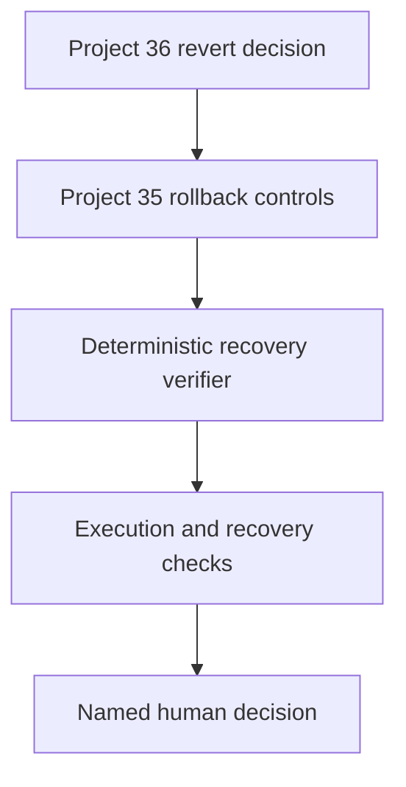

# Product Planning Policy Reversion & Recovery Verifier

Project 37 closes the failure path in ProdMind's evidence-to-policy lifecycle. Project 36 can recommend a human-approved reversion when a planning policy no longer sustains its intended outcome. This project verifies that the approved prior version was actually restored, the rollback began inside its decision SLA, the full scope was reverted, and recovery remained stable before a human closes the event.

It does **not** execute a rollback, change policy, infer causality, or close an incident automatically.

## Why it belongs in ProdMind

A rollback button is not evidence of recovery. Product teams need a reviewable answer to four different questions: Was reversion authorized? Was it completed? Did the approved target version return? Did customer and operational guardrails remain healthy long enough to close? Project 37 makes those claims explicit and testable while retaining Project 32–36 lineage.

## Decision model

| Human decision | Passing controls | Output |
|---|---:|---|
| `close_reversion` | All | `verified_recovery` |
| `close_reversion` | Any failed | `blocked_close` |
| `continue_monitoring` or `escalate` | Any | `action_required` |

The engine checks:

- a named Project 36 `revert` decision;
- initiation inside Project 34's rollback decision SLA;
- strictly increasing execution evidence ending at 100%;
- the approved rollback target across execution and recovery;
- a configurable recovery window and evidence cadence;
- every declared Project 34 monitor against its threshold;
- complete, ordered evidence and a named human review.

## Architecture



The same engine runs as a standalone Cloudflare Worker and inside Project 7's connected workflow. It uses Web Platform APIs only: no paid model, database, SDK, or external service is required.

## API

`POST /api/planning-policy-recovery` requires `Authorization: Bearer <API_TOKEN>` and `Content-Type: application/json`.

```json
{
  "runs": [],
  "effectivenessReport": {"schemaVersion": "1.0.0", "policyReviews": []},
  "rolloutReport": {"schemaVersion": "1.0.0", "rollouts": []},
  "input": {
    "asOf": "2027-09-16T00:00:00Z",
    "minimumRecoveryDays": 14,
    "maximumSnapshotGapDays": 7,
    "reviews": []
  }
}
```

See [`docs/PRD.md`](docs/PRD.md) for the complete contract and boundaries.

## Run locally

```bash
npm test
npm run check
npx wrangler dev
```

Set the secret before deployment:

```bash
npx wrangler secret put API_TOKEN
npx wrangler deploy
```

Cloudflare Workers and static assets can run within Cloudflare's free allowances, subject to the account's current limits. The repository never stores credentials.

## Security and operational boundaries

- The health endpoint is public but reveals only whether a token is configured.
- All other API requests require a constant-time bearer-token comparison.
- Requests are same-origin, JSON-only, and capped at 2 MB.
- Browser security headers disable framing and cross-origin resource loading.
- Evidence is evaluated in memory and is not persisted by this standalone Worker.
- Threshold compliance establishes a deterministic review condition, not proof that the rollback caused recovery.

## Research basis

- [NIST SP 800-34 Rev. 1](https://csrc.nist.gov/pubs/sp/800/34/r1/upd1/final) frames contingency planning around recovery strategies, testing, and reconstitution.
- [Google SRE: Canarying Releases](https://sre.google/workbook/canarying-releases/) describes the value of known-good rollback paths and measurable release evaluation.

## License

MIT
